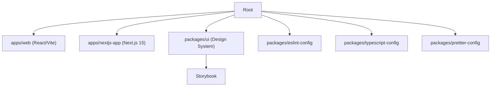

# Turborepo Monorepo Study

This repository is a personal study and experimentation ground for modern monorepo development using [Turborepo](https://turbo.build/).

---

## 📦 Monorepo Structure



- **Apps**: `web` (React/Vite), `nextjs-app` (Next.js 15, planned)
- **Packages**: `@jaeungkim/ui`, `@jaeungkim/eslint-config`, `@jaeungkim/typescript-config`, `@jaeungkim/prettier-config`
- **Storybook**: Integrated for the design system and/or UI packages

---

## 🚀 Purpose

- Learn and explore monorepo structure, build, and deployment with multiple frameworks and tools.
- Experiment with Next.js 15, React apps, a shared design system, Storybook, and custom CI/CD strategies for each app and package.

---

## ⚙️ CI/CD

- Each app and package can have its own CI/CD workflow (e.g., GitHub Actions), Dockerfile, and deployment strategy.
- The goal is to understand how to manage independent build, test, and deploy pipelines within a single monorepo.

---

## 🛠️ Tech Stack

- [Turborepo](https://turbo.build/) for monorepo orchestration
- [Next.js 15](https://nextjs.org/) and [React](https://react.dev/) for apps
- [Storybook](https://storybook.js.org/) for UI development
- [TypeScript](https://www.typescriptlang.org/), [ESLint](https://eslint.org/), [Prettier](https://prettier.io/)

---

## 🔄 Version Control & Safe Upgrades with Changesets

This monorepo uses [Changesets](https://github.com/changesets/changesets) to safely version and upgrade internal packages. Each app can use the version of a shared package it wants, making upgrades explicit and traceable.

### Changesets Workflow (Summary)

1. Make your changes to a package (e.g., update a rule in `eslint-config`).
2. Run `yarn changeset` and follow the prompts.
3. Commit your code and the changeset file.
4. Run `yarn changeset version` to bump versions and update changelogs.
5. Commit and push the version bumps.
6. In each app's `package.json`, specify the version of the shared package you want to use. Run `yarn install` to update dependencies.

---

## 🧩 Using Different Versions of Internal Packages

Each app or package can use a different version of a shared internal package. For example:

- In `apps/web/package.json`:
  ```json
  "devDependencies": {
    "@jaeungkim/eslint-config": "1.0.0"
  }
  ```
- In `apps/nextjs-app/package.json`:
  ```json
  "devDependencies": {
    "@jaeungkim/eslint-config": "2.0.0"
  }
  ```

After updating the versions, run:

```sh
yarn install
```

**How does this work?**

- Modern package managers like Yarn Berry and pnpm support multiple versions of the same internal package in a monorepo.
- Each app's `package.json` specifies the version it wants.
- The package manager links the correct version for each app, even if that means having multiple versions in the monorepo at once.

---

> This repo is for **learning and experimentation**. Expect breaking changes, new tools, and evolving structure as I explore best practices for monorepos!
