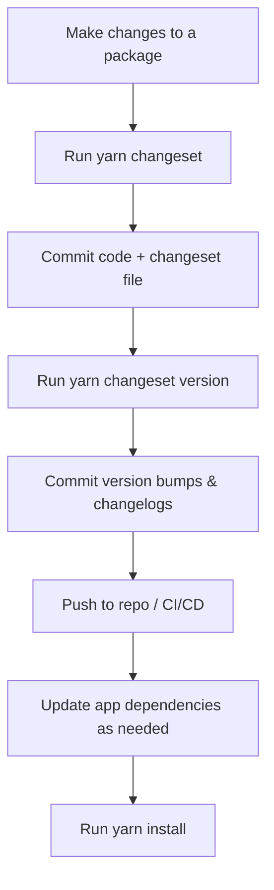

# Turborepo Monorepo Study

This repository is a personal study and experimentation ground for modern monorepo development using [Turborepo](https://turbo.build/).

---

## 📦 Monorepo Structure

```mermaid
flowchart TD
  A[Root] --> B[apps/web (React/Vite)]
  A --> C[apps/nextjs-app (Next.js 15)]
  A --> D[packages/ui (Design System)]
  A --> E[packages/eslint-config]
  A --> F[packages/typescript-config]
  A --> G[packages/prettier-config]
  D -->|Storybook| H[Storybook]
```

- **Apps**
  - `web`: React (Vite) app
  - `nextjs-app`: (Planned) Next.js 15 app
- **Packages**
  - `@jaeungkim/ui`: Shared UI component library (design system)
  - `@jaeungkim/eslint-config`: Shared ESLint config
  - `@jaeungkim/typescript-config`: Shared TypeScript config
  - `@jaeungkim/prettier-config`: Shared Prettier config
- **Storybook**
  - Integrated for the design system and/or UI packages

---

## 🚀 Purpose

- **Learn and explore** monorepo structure, build, and deployment with multiple frameworks and tools.
- **Experiment** with Next.js 15, React apps, a shared design system, Storybook, and custom CI/CD strategies for each app and package.

---

## ⚙️ CI/CD

- Each app and package can have its own CI/CD workflow (e.g., GitHub Actions), Dockerfile, and deployment strategy.
- The goal is to understand how to manage independent build, test, and deploy pipelines within a single monorepo.

---

## 🛠️ Tech Stack

- [Turborepo](https://turbo.build/) for monorepo orchestration
- [Next.js 15](https://nextjs.org/) and [React](https://react.dev/) for apps
- [Storybook](https://storybook.js.org/) for UI development
- [TypeScript](https://www.typescriptlang.org/), [ESLint](https://eslint.org/), [Prettier](https://prettier.io/)

---

## 🔄 Version Control & Safe Upgrades with Changesets

This monorepo uses [Changesets](https://github.com/changesets/changesets) to safely version and upgrade internal packages. This allows each app to use the version of a shared package it wants, and makes upgrades explicit and traceable.

### 📝 Changesets Workflow



#### **Step-by-step:**
1. **Make your changes** to a package (e.g., update a rule in `eslint-config`).
2. **Create a changeset:**
   ```sh
   yarn changeset
   ```
   - Follow the prompts to describe your change and select affected packages.
3. **Commit your changes** (including the new changeset file):
   ```sh
   git add .
   git commit -m "feat(eslint-config): update rule X"
   ```
4. **Version and release:**
   - When ready, run:
     ```sh
     yarn changeset version
     ```
   - This bumps versions and updates changelogs.
   - Commit these changes:
     ```sh
     git add .
     git commit -m "chore(release): version packages"
     git push
     ```
5. **Update app dependencies** as needed:
   - In each app's `package.json`, specify the version of the shared package you want to use.
   - Run `yarn install` to update dependencies.

> This workflow allows you to safely upgrade apps to new versions of shared packages when you're ready, and to track all changes and releases in git.

---

## 🧩 Using Different Versions of Internal Packages in Apps

With this versioned monorepo setup, each app or package can use a different version of a shared internal package. For example, if you release `@jaeungkim/eslint-config@2.0.0`, but want `web` to use `1.0.0` and `nextjs-app` to use `2.0.0`, you can do so:

- In `apps/web/package.json`:
  ```json
  "devDependencies": {
    "@jaeungkim/eslint-config": "1.0.0"
  }
  ```
- In `apps/nextjs-app/package.json`:
  ```json
  "devDependencies": {
    "@jaeungkim/eslint-config": "2.0.0"
  }
  ```

After updating the versions, run:
```sh
yarn install
```

Each app will use the version you specify. This allows for safe, gradual upgrades and easy rollback if needed.

### How Does This Work?

> **Modern package managers like Yarn Berry and pnpm support multiple versions of the same internal package within a monorepo.**

- Each app's or package's `package.json` specifies the version of the internal package it wants.
- The package manager installs and links the correct version for each app, even if that means having multiple versions in the monorepo at once.
- When you run scripts or tools in each app, they use the version of the shared package you specified.
- This is possible because these package managers use a content-addressable store (not just a flat `node_modules`), so they can keep multiple versions side-by-side and link them as needed.

**Visual:**

```mermaid
flowchart TD
  subgraph Monorepo
    direction TB
    A1[apps/web] -->|uses| B1[@jaeungkim/eslint-config@1.0.0]
    A2[apps/nextjs-app] -->|uses| B2[@jaeungkim/eslint-config@2.0.0]
    B1 -.->|shared| C1[packages/eslint-config]
    B2 -.->|shared| C1
  end
```

---

> This repo is for **learning and experimentation**. Expect breaking changes, new tools, and evolving structure as I explore best practices for monorepos!
